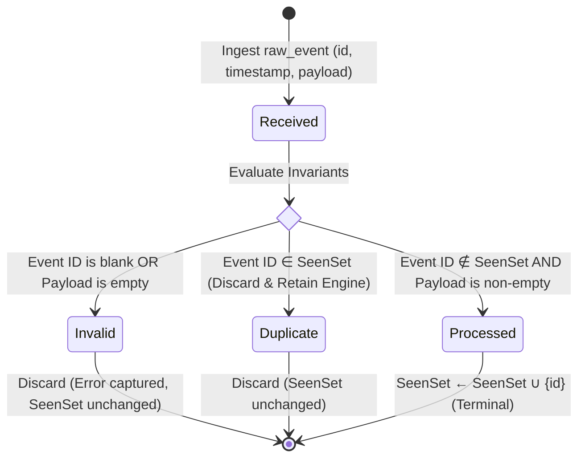

# Idempotent Event Ingestion Engine (OCaml 5.x)

[](https://ocaml.org)
[](https://dune.build)
[-brightgreen.svg?style=flat-square)](#verification--test-execution)
[](#engineering-policy--rules)
[](LICENSE)

> High-integrity, strictly typed idempotent event ingestion engine built in OCaml 5.x and Dune. Implements an explicit four-state lifecycle with Algebraic Data Types (ADTs), purely functional immutable state transitions, zero-exception safety, and formal deduplication invariants.

**Lead Architect:** William Free Hall (Free) • [whall4.wh@gmail.com](mailto:whall4.wh@gmail.com) • [LinkedIn](https://linkedin.com/in/william-free-hall)  
**System Specification:** [SYSTEM_SPEC.md](SYSTEM_SPEC.md) • **Agent Rules & Policy:** [.agents/rules](.agents/rules)

---

## 🏛️ State Machine Architecture

Every incoming transaction event progresses through an explicit, strongly typed four-state lifecycle represented by native OCaml sum types:



### Transition Matrix

| Current State | Guard Condition | Target State | Seen Set Mutation | Resulting Action |
| :--- | :--- | :--- | :--- | :--- |
| `Received(evt)` | `trim(id) == ""` | `Invalid { id; error = "Event ID cannot be blank" }` | None | Discarded, error reported |
| `Received(evt)` | `trim(payload) == ""` | `Invalid { id; error = "Payload cannot be empty" }` | None | Discarded, error reported |
| `Received(evt)` | `id ∈ seen_ids` | `Duplicate { id; timestamp }` | None | Discarded, deduplicated |
| `Received(evt)` | `id ∉ seen_ids` | `Processed { id; timestamp; payload }` | `seen_ids + id` | Committed to seen store |
| `Processed` | Any | `Processed` (Idempotent) | None | Identity step |
| `Duplicate` | Any | `Duplicate` (Idempotent) | None | Identity step |
| `Invalid` | Any | `Invalid` (Idempotent) | None | Identity step |

---

## 🔒 Core Invariants & Guarantees

1. **Deduplication Invariant**: No duplicate event ID may ever enter the `Processed` state. Subsequent arrivals with an identical ID are safely categorized as `Duplicate` and discarded.
2. **Payload Hygiene Invariant**: Empty or whitespace-only payloads never reach `Processed`. They are classified as `Invalid`.
3. **Identifier Validity Invariant**: Blank or whitespace-only event IDs are immediately rejected into `Invalid`.
4. **Zero-Exception Policy**: State transitions never raise exceptions (`raise`, `failwith`, `assert`). All outcomes return an explicit `(engine * state)` tuple.
5. **Zero Wildcard Catch-Alls (`_`)**: In accordance with the engineering policy, all pattern matching across states is 100% exhaustive. Constructor matching explicitly binds all fields, ensuring the compiler guarantees exhaustive state coverage.
6. **Complexity Guarantees**:
   * **Deduplication Lookup**: $\mathcal{O}(\log N)$ persistent set membership via Red-Black/AVL balanced binary tree (`Set.Make(String)`).
   * **Storage & Concurrency**: 100% immutable and thread-safe.

---

## 📂 Project Structure

```text
.
├── .agents/
│   └── rules                     # Antigravity OCaml engineering policy & verification constraints
├── .github/
│   └── workflows/
│       └── ci.yml                # Automated Dune build & test CI workflow
├── lib/
│   ├── dune                      # Strict compilation flags (-warn-error +A-44)
│   ├── event_engine.mli          # Public interface with explicit ADT signatures
│   └── event_engine.ml           # Pure functional state machine implementation
├── test/
│   ├── dune                      # Test harness compilation rules
│   └── test_event_engine.ml      # 23-assertion verification suite
├── dune-project                  # Dune project manifest
├── SYSTEM_SPEC.md                # Formal system specification
├── .gitignore                    # Build artifact exclusions
└── README.md                     # Engineering documentation
```

---

## 🚀 Quickstart & Usage

### Basic Event Processing

```ocaml
open Event_engine

(* 1. Initialize an empty engine *)
let engine0 = empty in

(* 2. Ingest a valid event *)
let event1 = { id = "tx-1001"; timestamp = 1728115200; payload = "TRANSFER $500" } in
let engine1, state1 = ingest engine0 event1 in
(* state1 is Processed { id = "tx-1001"; timestamp = 1728115200; payload = "TRANSFER $500" } *)

(* 3. Attempt to ingest a duplicate event *)
let event1_dup = { id = "tx-1001"; timestamp = 1728115205; payload = "TRANSFER $500 (RETRY)" } in
let engine2, state2 = ingest engine1 event1_dup in
(* state2 is Duplicate { id = "tx-1001"; timestamp = 1728115205 } *)
(* engine2 is identical to engine1; seen count remains 1 *)

(* 4. Ingest an invalid empty payload *)
let event_invalid = { id = "tx-1002"; timestamp = 1728115210; payload = "   " } in
let engine3, state3 = ingest engine2 event_invalid in
(* state3 is Invalid { id = "tx-1002"; error = "Payload cannot be empty" } *)
```

---

## 🧪 Verification & Test Execution

The codebase enforces strict compiler hygiene with `-warn-error +A-44` (turning all warnings into errors).

### 1-Command Local Verification

```bash
# Build the project and verify type safety
dune build

# Run the 23-assertion test suite
dune runtest
```

### Test Harness Coverage Output

```text
========================================
 OCaml Event Engine Verification Suite
========================================

Test Suite 1: Valid Event Transition
  [PASS] Initial engine has 0 seen events
  [PASS] evt-1 is not seen initially
  [PASS] Event 1 transitioned to Processed
  [PASS] Engine recorded evt-1
  [PASS] Engine seen count is 1
  [PASS] Event 2 transitioned to Processed
  [PASS] Engine recorded evt-2
  [PASS] Engine seen count is 2

Test Suite 2: Duplicate Detection and Discard
  [PASS] First arrival processed successfully
  [PASS] Duplicate event correctly classified as Duplicate
  [PASS] Engine seen count did not increase on duplicate
  [PASS] Duplicate engine state matches first engine state

Test Suite 3: Empty Payload Rejection
  [PASS] Empty payload transitioned to Invalid
  [PASS] Empty payload event ID not added to seen set
  [PASS] Engine seen count remains 0
  [PASS] Whitespace payload transitioned to Invalid
  [PASS] Whitespace event ID not added to seen set

Test Suite 4: Blank Event ID Rejection
  [PASS] Blank ID transitioned to Invalid
  [PASS] Engine seen count remains 0
  [PASS] Spaces ID transitioned to Invalid
  [PASS] Spaces ID event not added to seen set

Test Suite 5: Idempotence of Terminal States
  [PASS] Transition on already Processed state is idempotent
  [PASS] Engine remains unchanged after stepping Processed

========================================
 Result: 23 / 23 tests passed successfully.
========================================
```

---

## 📜 Engineering Policy & Rules

This project strictly adheres to the Autonomous Systems Engineering Policy defined in [.agents/rules](.agents/rules):

1. **Exhaustive ADTs**: Every state transition uses explicit variant constructors.
2. **No Wildcard Catch-Alls**: Every match branch explicitly names its constructor and fields.
3. **Self-Healing Verification**: Re-verification via Dune runs continuously on every change until the exit code is strictly 0.

---

## 📄 License

Distributed under the MIT License. See [LICENSE](LICENSE) for details.
