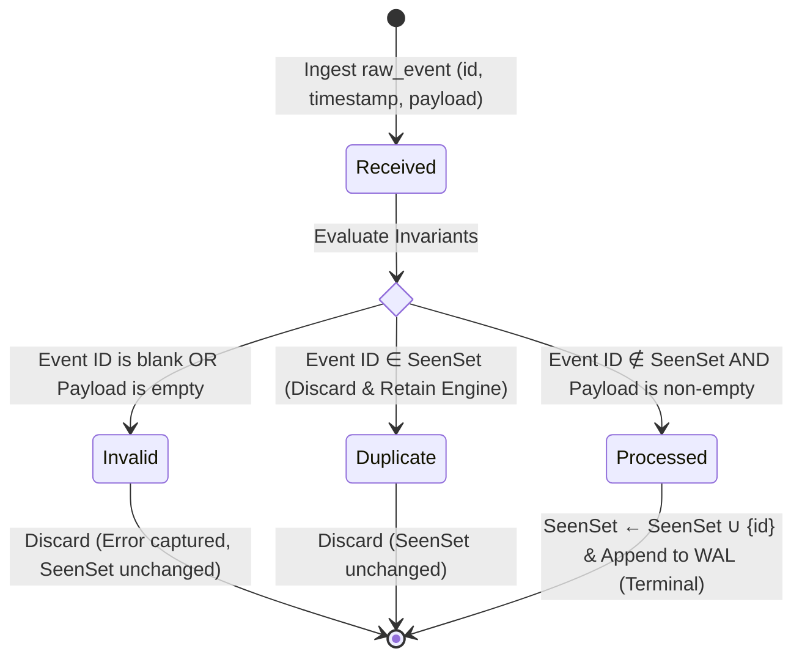
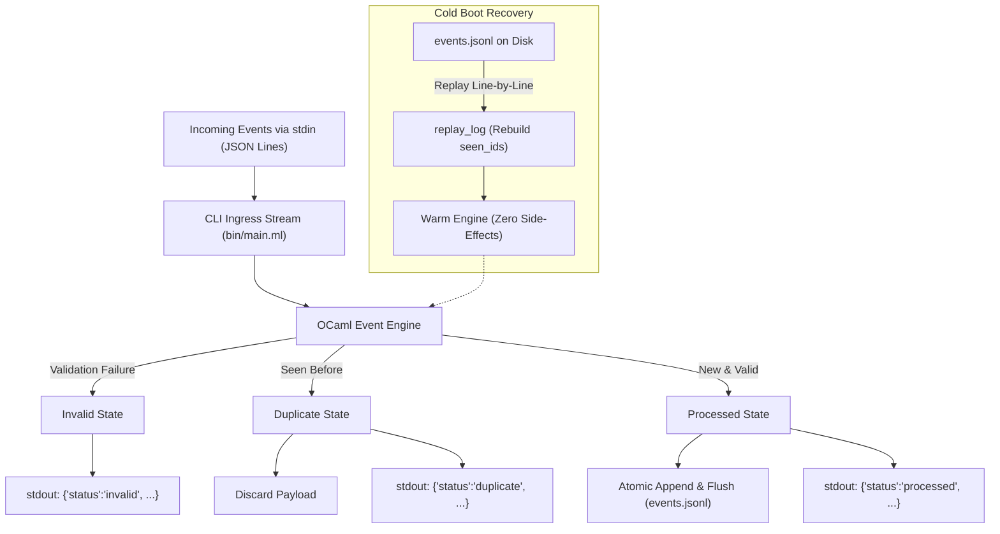

# Idempotent Event Ingestion Engine (OCaml 5.x)

[](https://ocaml.org)
[](https://dune.build)
[-brightgreen.svg?style=flat-square)](#verification--test-execution)
[](#engineering-policy--rules)
[](#phase-3-wal-compaction--atomic-rotation)
[](#container-distribution--scratch-image)
[](LICENSE)

> High-integrity, strictly typed idempotent event ingestion engine built in OCaml 5.x and Dune. Implements an explicit four-state lifecycle with Algebraic Data Types (ADTs), purely functional immutable state transitions, zero-exception safety, and durable Write-Ahead Logging (WAL) for cold-boot crash recovery.

**Lead Architect:** William Free Hall (Free) • [whall4.wh@gmail.com](mailto:whall4.wh@gmail.com) • [LinkedIn](https://linkedin.com/in/william-free-hall)  
**System Specification:** [SYSTEM_SPEC.md](SYSTEM_SPEC.md) • **Agent Rules & Policy:** [.agents/rules](.agents/rules)

---

## 🏛️ State Machine Architecture

Every incoming transaction event progresses through an explicit, strongly typed four-state lifecycle represented by native OCaml sum types:



### Transition Matrix

| Current State | Guard Condition | Target State | Seen Set Mutation | Resulting Action |
| :--- | :--- | :--- | :--- | :--- |
| `Received(evt)` | `trim(id) == ""` | `Invalid { id; error = "Event ID cannot be blank" }` | None | Discarded, error reported |
| `Received(evt)` | `trim(payload) == ""` | `Invalid { id; error = "Payload cannot be empty" }` | None | Discarded, error reported |
| `Received(evt)` | `id ∈ seen_ids` | `Duplicate { id; timestamp }` | None | Discarded, deduplicated |
| `Received(evt)` | `id ∉ seen_ids` | `Processed { id; timestamp; payload }` | `seen_ids + id` | Committed to seen store & appended to WAL |
| `Processed` | Any | `Processed` (Idempotent) | None | Identity step |
| `Duplicate` | Any | `Duplicate` (Idempotent) | None | Identity step |
| `Invalid` | Any | `Invalid` (Idempotent) | None | Identity step |

---

## 💾 Phase 2: Persistence & WAL Architecture

To survive process restarts and integrate with standard UNIX streaming pipelines without external database dependencies, the engine implements an append-only Write-Ahead Log (`events.jsonl`):



### Key Durability Invariants
1. **Cold Boot Recovery**: On startup, `replay_log` populates `engine.seen_ids` before ingress opens. No side effects are re-emitted during recovery.
2. **Atomic Append & Flush**: Every event reaching `Processed` appends a serialized JSON line to `events.jsonl` with an explicit flush (`flush oc`) to prevent partial line writes during crash events.
3. **Idempotent Crash Semantics**: If interrupted mid-flight, uncommitted events are safely deduplicated or processed cleanly upon reboot without corrupting state.

---

## 🔒 Core Invariants & Guarantees

1. **Deduplication Invariant**: No duplicate event ID may ever enter the `Processed` state. Subsequent arrivals with an identical ID are safely categorized as `Duplicate` and discarded.
2. **Payload Hygiene Invariant**: Empty or whitespace-only payloads never reach `Processed`. They are classified as `Invalid`.
3. **Identifier Validity Invariant**: Blank or whitespace-only event IDs are immediately rejected into `Invalid`.
4. **Zero-Exception Policy**: State transitions never raise exceptions (`raise`, `failwith`, `assert`). All outcomes return explicit variants or Result types.
5. **Zero Wildcard Catch-Alls (`_`)**: In accordance with the engineering policy, all pattern matching across states is 100% exhaustive. Constructor matching explicitly binds all fields, ensuring the compiler guarantees exhaustive state coverage.
6. **Complexity Guarantees**:
   * **Deduplication Lookup**: $\mathcal{O}(\log N)$ persistent set membership via Red-Black/AVL balanced binary tree (`Set.Make(String)`).
   * **WAL Write Overhead**: $\mathcal{O}(1)$ sequential append.
   * **Thread Safety**: 100% immutable in-memory engine structures.

---

## 📂 Project Structure

```text
.
├── .agents/
│   └── rules                     # Antigravity OCaml engineering policy & verification constraints
├── .github/
│   └── workflows/
│       └── ci.yml                # Automated Dune build & test CI workflow
├── bin/
│   ├── dune                      # Standalone CLI binary compilation rules
│   └── main.ml                   # Streaming stdin/stdout pipeline with WAL integration
├── lib/
│   ├── dune                      # Strict library flags (-warn-error +A-44)
│   ├── event_engine.mli          # Public interface with explicit ADT signatures
│   └── event_engine.ml           # Pure state machine + JSON serde + WAL persistence
├── test/
│   ├── dune                      # Test harness compilation rules
│   └── test_event_engine.ml      # 39-assertion verification suite (unit + WAL replay)
├── dune-project                  # Dune project manifest
├── SYSTEM_SPEC.md                # Formal system specification (Phase 1 & Phase 2)
├── .gitignore                    # Build artifact exclusions
└── README.md                     # Engineering documentation
```

---

## 🚀 Quickstart & CLI Usage

### 1. Interactive Ingress via Terminal / Shell

```bash
# Run the binary and pipe JSON events into standard input
dune exec bin/main.exe <<EOF
{"id":"evt-100","timestamp":1728101000,"payload":"init_record"}
{"id":"evt-100","timestamp":1728101005,"payload":"duplicate_attempt"}
{"id":"evt-101","timestamp":1728101010,"payload":"second_event"}
EOF
```

**Standard Output (`stdout`)**:
```json
{"status":"processed","id":"evt-100"}
{"status":"duplicate","id":"evt-100"}
{"status":"processed","id":"evt-101"}
```

**Durable Write-Ahead Log (`events.jsonl`)**:
```json
{"id":"evt-100","timestamp":1728101000,"payload":"init_record"}
{"id":"evt-101","timestamp":1728101010,"payload":"second_event"}
```

### 2. Cold-Boot Crash Recovery Test

Restarting the process against an existing `events.jsonl` log automatically hydrates `seen_ids`:
```bash
dune exec bin/main.exe <<EOF
{"id":"evt-100","timestamp":1728101020,"payload":"re-submitted"}
EOF
```
**Output**:
```json
{"status":"duplicate","id":"evt-100"}
```

---

## 🧪 Verification & Test Execution

The codebase enforces strict compiler hygiene with `-warn-error +A-44` (turning all warnings into errors).

### 1-Command Local Verification

```bash
# Build both the library and CLI executable
dune build

# Run the 39-assertion test suite
dune runtest
```

### Test Harness Coverage Output

```text
========================================
 OCaml Event Engine Verification Suite
========================================

Test Suite 1: Valid Event Transition
  [PASS] Initial engine has 0 seen events
  [PASS] evt-1 is not seen initially
  [PASS] Event 1 transitioned to Processed
  [PASS] Engine recorded evt-1
  [PASS] Engine seen count is 1
  [PASS] Event 2 transitioned to Processed
  [PASS] Engine recorded evt-2
  [PASS] Engine seen count is 2

Test Suite 2: Duplicate Detection and Discard
  [PASS] First arrival processed successfully
  [PASS] Duplicate event correctly classified as Duplicate
  [PASS] Engine seen count did not increase on duplicate
  [PASS] Duplicate engine state matches first engine state

Test Suite 3: Empty Payload Rejection
  [PASS] Empty payload transitioned to Invalid
  [PASS] Empty payload event ID not added to seen set
  [PASS] Engine seen count remains 0
  [PASS] Whitespace payload transitioned to Invalid
  [PASS] Whitespace event ID not added to seen set

Test Suite 4: Blank Event ID Rejection
  [PASS] Blank ID transitioned to Invalid
  [PASS] Engine seen count remains 0
  [PASS] Spaces ID transitioned to Invalid
  [PASS] Spaces ID event not added to seen set

Test Suite 5: Idempotence of Terminal States
  [PASS] Transition on already Processed state is idempotent
  [PASS] Engine remains unchanged after stepping Processed

Test Suite 6: JSON Serialization & Status Formats
  [PASS] event_to_json produces valid JSON string
  [PASS] event_of_json parsed back correctly
  [PASS] event_of_json handles permuted key order
  [PASS] event_of_json cleanly rejects malformed syntax
  [PASS] status_to_json Processed format
  [PASS] status_to_json Duplicate format
  [PASS] status_to_json Invalid format

Test Suite 7: Write-Ahead Log (WAL) Replay & Invariants
  [PASS] WAL file was created
  [PASS] Replayed engine has count 2
  [PASS] Replayed engine recorded evt-wal-1
  [PASS] Replayed engine recorded evt-wal-2
  [PASS] Replayed engine correctly transitioned duplicate to Duplicate
  [PASS] Engine seen count unaffected by duplicate
  [PASS] New event processed on top of replayed engine
  [PASS] Engine seen count incremented to 3
  [PASS] Temporary WAL cleaned up

Test Suite 8: WAL Rotation & Snapshot Recovery
  [PASS] should_rotate is false when WAL does not exist
  [PASS] should_rotate is false under 150 bytes
  [PASS] should_rotate flips to true once WAL crosses 150 bytes
  [PASS] create_snapshot succeeded
  [PASS] snapshot.json exists
  [PASS] snapshot.json.tmp does not remain
  [PASS] snapshot.json contains snap-1
  [PASS] snapshot.json contains snap-5
  [PASS] rotate_wal succeeded
  [PASS] events.jsonl.1 exists
  [PASS] snapshot.json exists after rotation
  [PASS] active events.jsonl exists
  [PASS] active events.jsonl is reset to 0 bytes
  [PASS] Recovered engine contains snap-1 from snapshot
  [PASS] Recovered engine contains snap-5 from snapshot
  [PASS] Recovered engine contains post-rot-delta from active WAL
  [PASS] Recovered engine seen count is at least 6
  [PASS] Ingesting snap-3 into recovered engine yields Duplicate

========================================
 Result: 57 / 57 tests passed successfully.
========================================
```

---

## 🔄 Phase 3: WAL Compaction & Atomic Rotation

To prevent unbounded log file growth while guaranteeing zero data loss, the engine incorporates bounded rotation and two-tier recovery:

1. **Size-Triggered Checkpoint**: When `events.jsonl` crosses `max_log_bytes` (default: 10MB, configurable), compaction triggers.
2. **Crash-Safe Temporary Snapshot**: Engine state (`seen_ids` and timestamp) is flushed to `snapshot.json.tmp` and atomically renamed to `snapshot.json`.
3. **Atomic Archive Rotation**: `events.jsonl` is atomically renamed to `events.jsonl.1`, and a clean active log is opened for incoming ingress.
4. **Two-Tier Cold Boot Recovery**:
   - Ingest `snapshot.json` (if present) to reconstruct base state.
   - Replay archived tail writes (`events.jsonl.1`) if a rotation was in flight during power loss.
   - Replay active log (`events.jsonl`) to apply uncompacted deltas.

---

## 🐳 Container Distribution & Scratch Image

The engine compiles via musl libc into a static, zero-dependency native ELF binary and packages onto an empty `scratch` image with **zero OS bloat**:

- **Registry Image:** `ghcr.io/freefades2black/ocaml-event-engine:latest`
- **Total Image Size:** **1.64 MB** disk footprint (compressed layer: **480 kB**)
- **Dynamic Linker Dependencies:** Zero (`Not a valid dynamic program`)

### Run via Docker
```bash
docker run --rm -i ghcr.io/freefades2black/ocaml-event-engine:latest << 'EOF'
{"id":"evt-001","timestamp":1728100000,"payload":"sensor_payload_active"}
{"id":"evt-001","timestamp":1728100005,"payload":"sensor_payload_active"}
{"id":"","timestamp":1728100010,"payload":"invalid_record"}
{"id":"evt-002","timestamp":1728100015,"payload":"new_sensor_record"}
EOF
```

Output:
```json
{"status":"processed","id":"evt-001"}
{"status":"duplicate","id":"evt-001"}
{"status":"invalid","id":"","error":"Event ID cannot be blank"}
{"status":"processed","id":"evt-002"}
```

---

## 📜 Engineering Policy & Rules

This project strictly adheres to the Autonomous Systems Engineering Policy defined in [.agents/rules](.agents/rules):

1. **Exhaustive ADTs**: Every state transition uses explicit variant constructors.
2. **No Wildcard Catch-Alls**: Every match branch explicitly names its constructor and fields.
3. **Self-Healing Verification**: Re-verification via Dune runs continuously on every change until the exit code is strictly 0.

---

## 📄 License

Distributed under the MIT License. See [LICENSE](LICENSE) for details.
